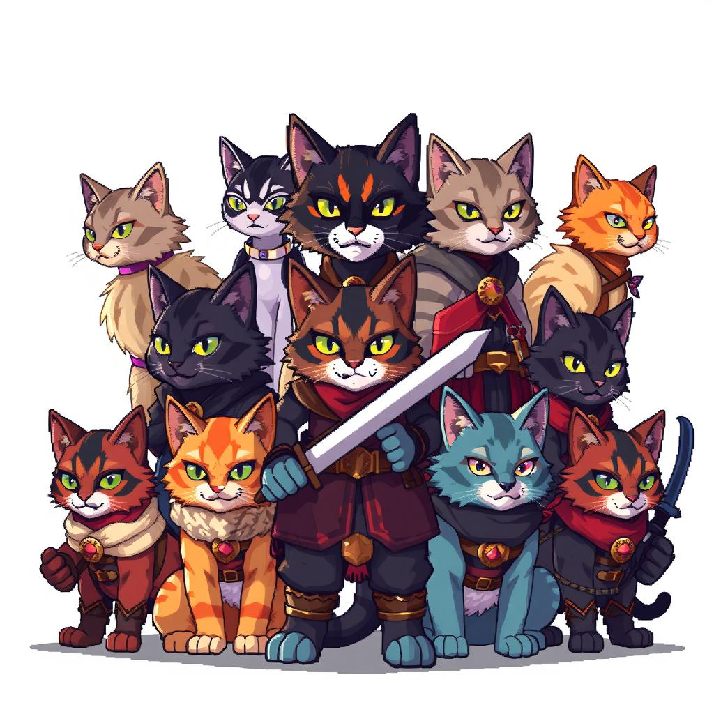

# Pixel Cat Warriors (WRRCAT)

Welcome to the world of Pixel Cat Warriors - where feline heroes meet classic RPG nostalgia! This collection brings to life a unique series of warrior cats rendered in authentic 16-bit pixel art style, reminiscent of beloved retro games.

## About The Collection

Pixel Cat Warriors is a limited collection of 100 uniquely generated warrior cats, each crafted with meticulous attention to retro gaming aesthetics. Drawing inspiration from legendary RPGs like Dragon Quest and Secret of Mana, each warrior cat comes with distinct traits and abilities that harken back to the golden age of pixel art gaming.

## Collection Details

- **Total Supply**: 100 unique NFTs
- **Mint Price**: 2,000 STARS
- **Mint Limit**: 8 NFTs per address
- **Blockchain**: Stargaze
- **Token Symbol**: WRRCAT

## Trait Categories

Each Pixel Cat Warrior is uniquely generated with combinations from 8 distinct trait categories:

1. **Warrior Class**
   - Includes Knight, Mage, Archer, and other classic RPG roles
   - Each class features unique visual attributes

2. **Weapons**
   - Cat-themed adaptations of classic RPG weapons
   - Variety of magical and physical armaments

3. **Armor Styles**
   - Inspired by traditional RPG equipment
   - Ranges from light to heavy armor sets

4. **Magical Effects**
   - Various auras and spell effects
   - Distinctive pixel art animation styles

5. **Fur Patterns**
   - Diverse cat coat patterns
   - Multiple color variations

6. **Special Features**
   - Unique ear types
   - Distinctive cat characteristics

7. **Color Palettes**
   - Authentic retro-gaming color schemes
   - Limited colors for true pixel art feel

8. **Background Elements**
   - RPG-themed environmental effects
   - Complementary pixel art backgrounds

## Art Style

Our collection features:
- Authentic 16-bit pixel art style
- Clean, sharp pixel edges
- No anti-aliasing for genuine retro feel
- Vibrant, limited color palettes
- 16x16 or 32x32 grid-based designs
- Classic NES/SNES aesthetic

*Note: This is part of the ZombCat NFT Collection series on the Stargaze blockchain.*